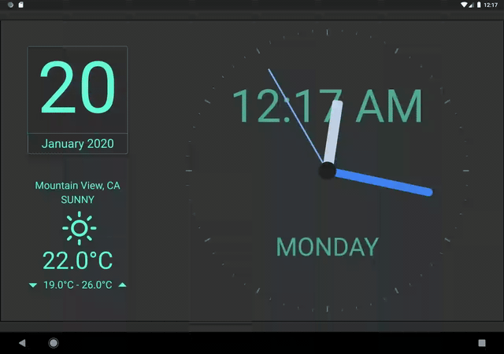

# Flutter Clock

Welcome to Flutter Clock!

See [flutter.dev/clock](https://flutter.dev/clock) for how to get started, submission requirements, contest rules, and FAQs.

See a [live demo](http://flutter-clock-lenovo.surge.sh/) with Flutter Clock for Web!

Example [Dark Theme]



Example [Light Theme]


# Getting Started
- Download repo using ```git clone```
- ```cd lenovo_clock```
- ```flutter create .```
- ```flutter run``` (on Android or iOS in landscape)
